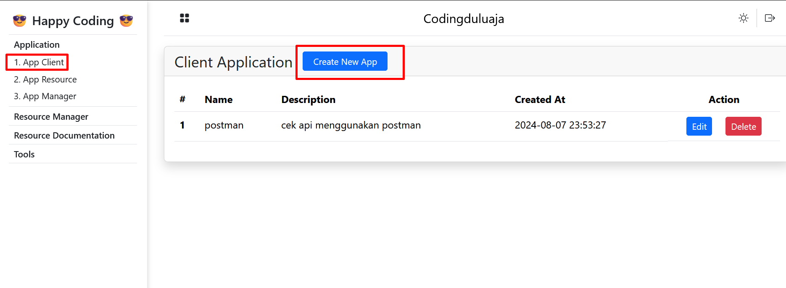
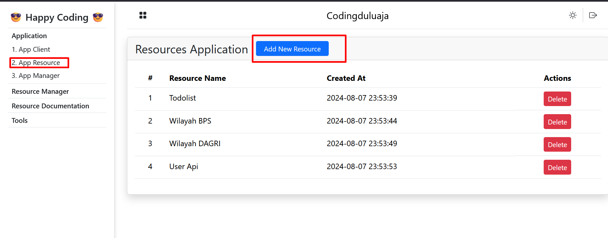
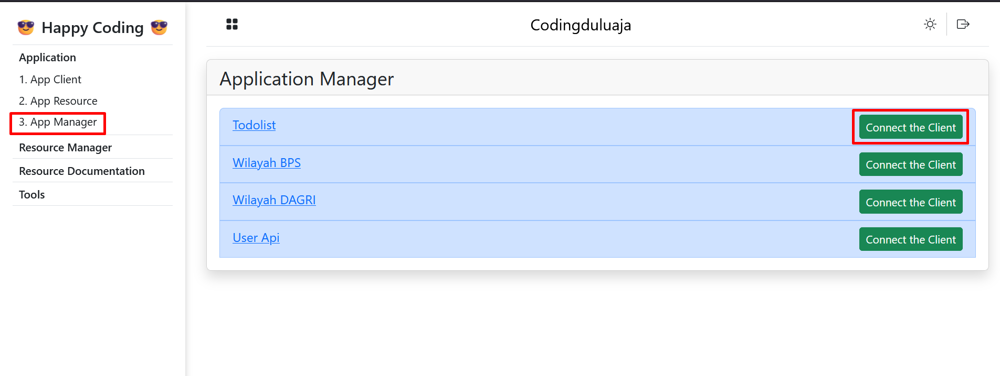
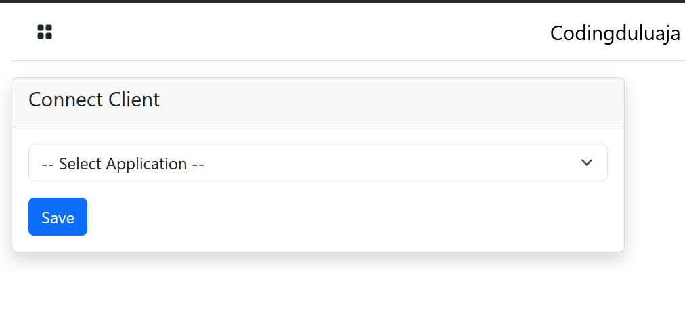
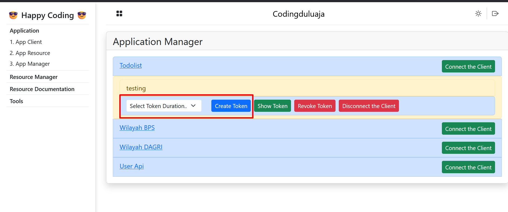
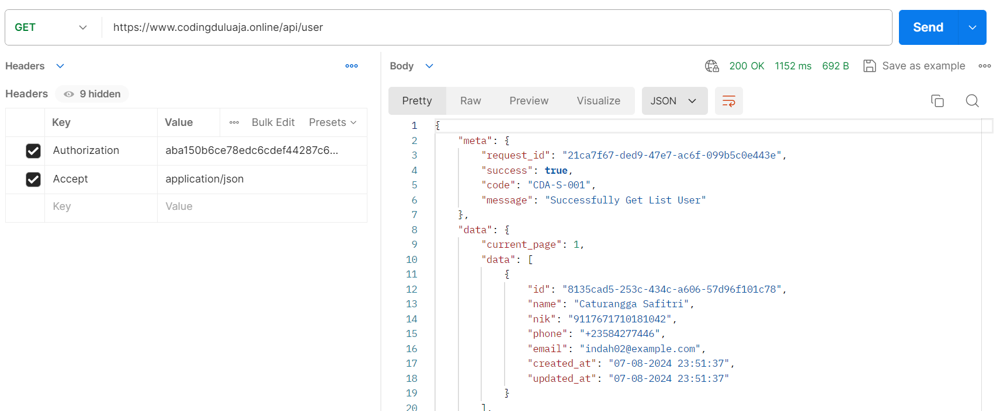

## Tentang Codingduluaja API

Codingduluaja API merupakan sebuat layanan (SaaS) yang menyediakan Open API sebagai berikut:

- Todolist
- Wilayah BPS
- Wilayah Dagri
- User

## How to Codingduluaja Api

1. Registration
2. Create Client
3. Create Resource
4. Connecting Resource to Client
5. Generate/Create Token
6. Use Token to Access Api (See Documentation For Detail)

### Registration
Registrasi Akun di [Codingduluaja API](https://codingduluaja.online). domain bisa berubah sewaktu-waktu.

### Create Client
Application > 1. App Client > Create New App

### Create Resource
Application > 2. App Resource > Add New Resource

### Connecting Resource to Client
Application > 3. App Manager > Connect the Client

### Generate/Create Token
Application > 3. App Manager > Pilih Resource > Pilih Client > Create Token

### Use Token to Access Api (See Documentation For Detail)
Contoh Penggunaan Token (Authorization)

